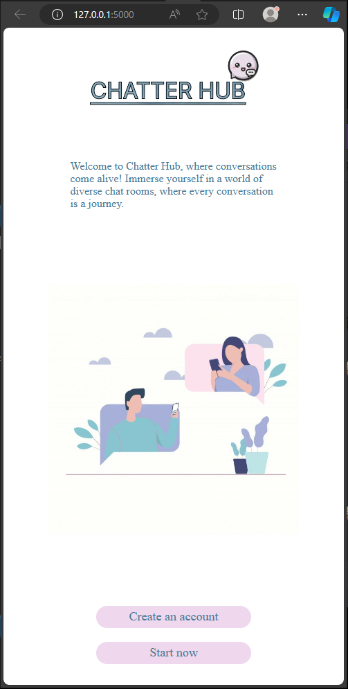
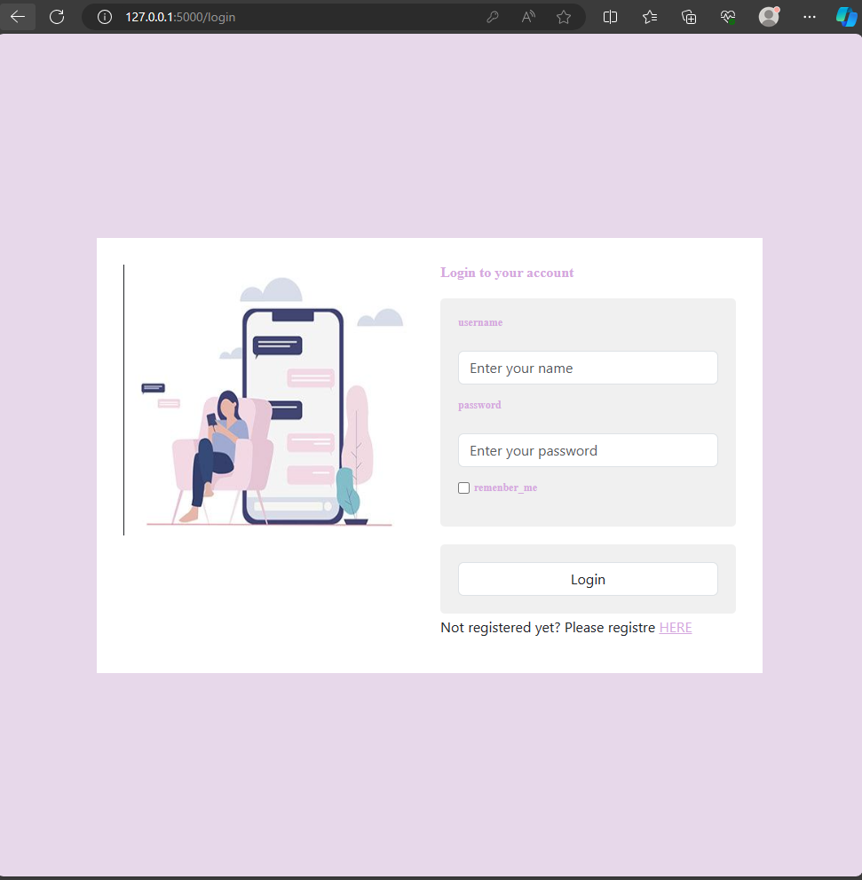
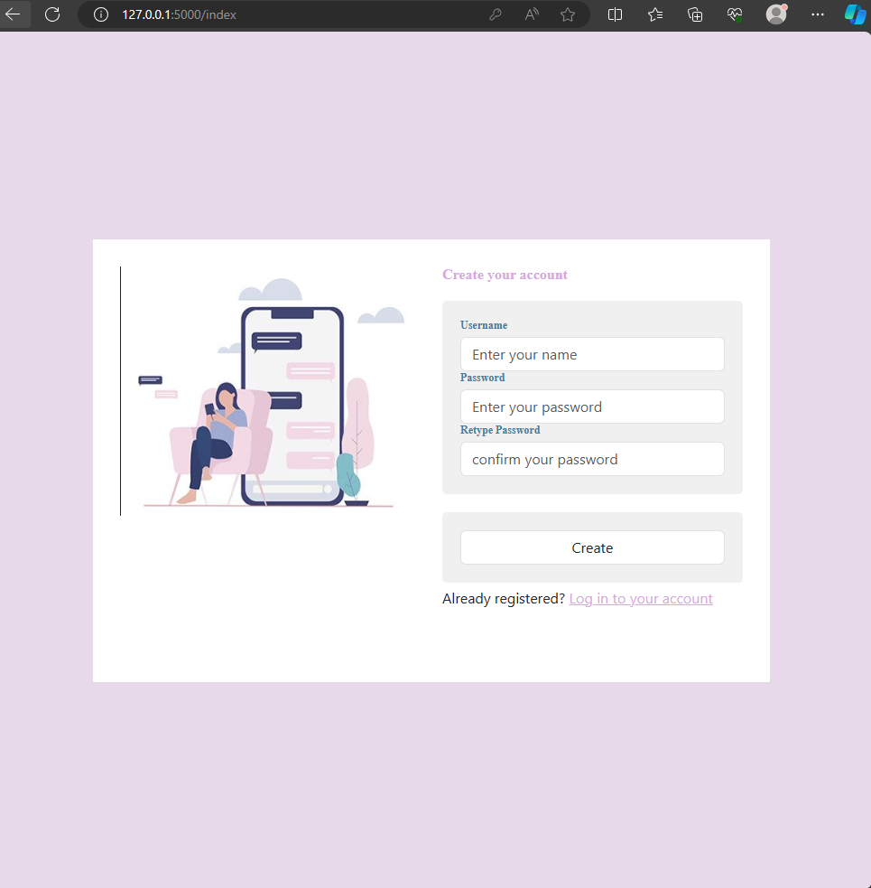
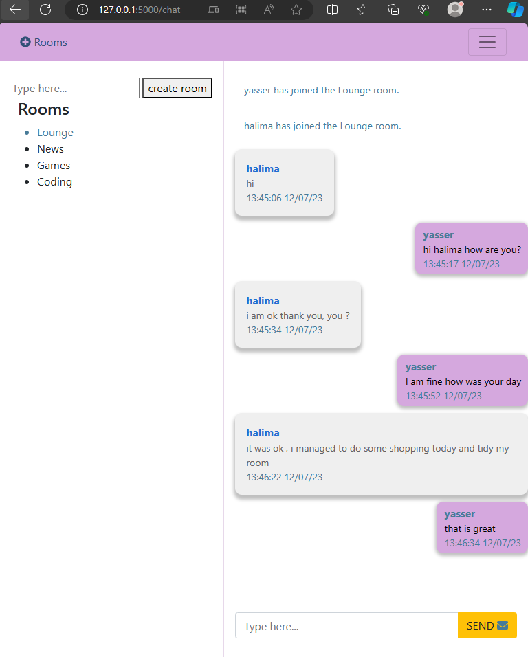

# Chatter hub Project

Chatter hub is a user-friendly chat application that simplifies online conversations. It enables users to create accounts, securely sign in, and engage in real-time discussions in custom chat rooms, enhancing communication in a seamless digital environment.

## Story

Chatter Hub, a project born in the ALX Africa program, started as a portfolio endeavor. Fueled by a thirst for practical application, it became a playground to explore new technologies, notably Socket.IO, for real-time communication.

## Table of Contents
- [Overview](#overview)
- [Features](#features)
- [Installation](#installation)
- [Usage](#usage)
- [Screenshot](#screenshot)
- [Authors](#Authors)
- [License](#license)

## Overview

Chatter Hub is a dynamic chat application designed by Laila and Fatima Zahra. It streamlines online conversations, offering users a user-friendly interface to create accounts, securely sign in, and participate in real-time discussions within custom chat rooms.


## Features

List of Key Features:
- **User-Friendly Interface:** Simplified chat experience for users.
- **Account Management:** Create accounts and securely sign in.
- **Real-Time Discussions:** Engage in dynamic, real-time conversations.
- **Custom Chat Rooms:** Create and join personalized chat spaces.

## Installation and usage 

Provide instructions on how to install your project. Include any dependencies and how to install them.

### 1.Install Dependencies:
```bash
# Install all the necessary dependencies
pip install -r requirements.txt

```
### 2.Prepare Your Database:
Run the following commands to set up the database:

```bash
-- Create a user with a password

CREATE USER chatapp WITH PASSWORD 'noor';
CREATE DATABASE chatapp WITH OWNER = chatapp;
GRANT ALL PRIVILEGES ON DATABASE chatapp TO chatapp;

```
 Create the users table:
```bash
-- Create the "users" table
CREATE TABLE users (
    id SERIAL PRIMARY KEY,
    username VARCHAR(25) UNIQUE NOT NULL,
    password VARCHAR NOT NULL
);
```
### 3. Run Flask Application:
Then run flask aplication 
```bash
# To run the flask application 
python3 app.py

```

Alternatively, you can vist [link to production server ](http://3.50.50.50.5)

## Screenshots

### Main Screen


Description: Overview of the main interface displaying key features.

### Login Screen

Description: User authentication screen for secure access.

### Registration Screen

Description: New user registration form for account creation.

### Chat Application

Description: Real-time chat interface for seamless communication.

## License

This project is licensed under the GNU GPLv3 - see the [LICENSE](https://choosealicense.com/licenses/gpl-3.0/) file for details.

## Authors
Laila hazim <[Laila](https://github.com/laila22haz)>

Fatimazahra kerdoun <[fatima zahra](https://github.com/Fatimazahraker)>